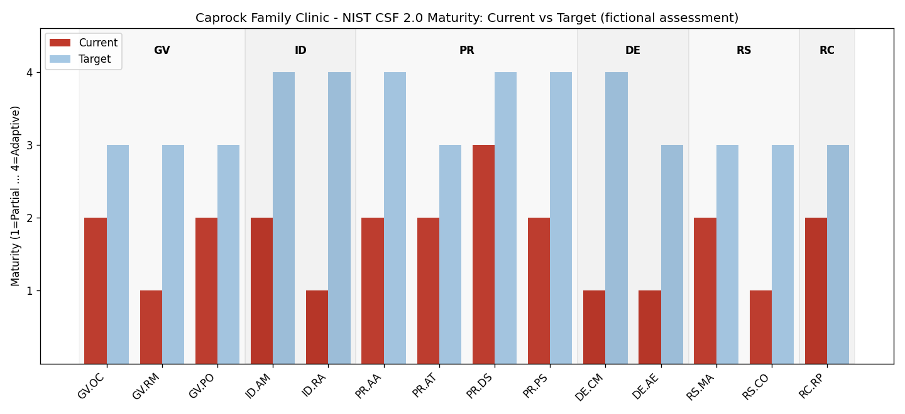
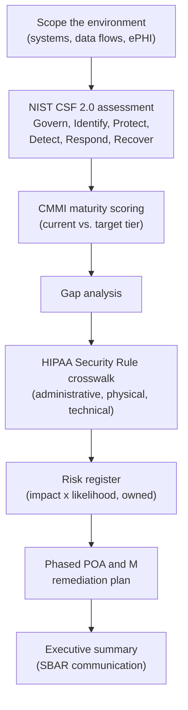

# NIST CSF 2.0 + HIPAA Security Risk Assessment

**A complete GRC deliverable set for a fictional 3-site clinic — scored maturity assessment, HIPAA crosswalk, owned risk register, and a sequenced POA&M.**



## Overview

GRC work product isn't scan results — it's the chain of documents that turns findings into funded, owned, sequenced action. This repository contains that full chain for **Caprock Family Clinic**, a fictional 85-person outpatient provider with a cloud EHR and on-prem AD:

1. **[NIST CSF 2.0 self-assessment](assessment/nist-csf-2.0-self-assessment.md)** — 14 categories scored on a 4-point maturity scale, evidence noted per score. Overall: 1.7 vs a 3.4 target; DETECT is the weakest function (1.0) — audit logs retained but never reviewed.
2. **[HIPAA Security Rule crosswalk](assessment/hipaa-security-rule-crosswalk.md)** — every gap tied to its citation, with Required vs Addressable called out. Headline finding: no documented Security Risk Analysis on file, the most-cited deficiency in OCR enforcement.
3. **[Risk register](risk-register/risk_register.md)** — 10 risks scored L×I, each with exactly one owner and one treatment decision ([CSV version](risk-register/risk_register.csv) for tooling).
4. **[POA&M](poam/poam.md)** — remediation in three phases (0–30, 31–90, 91–180 days) with evidence-based milestones, sequenced by legal exposure and risk-reduction-per-dollar, with the rationale written down.
5. **[Methodology](docs/methodology.md)** — why CSF 2.0 over 800-53 for this entity size, the evidence standard ("if it isn't written down, it scores 1"), and the traceability chain every finding must survive.

> The clinic, findings, and scores are fictional but calibrated to what small covered entities actually look like — the gaps mirror real OCR enforcement patterns.

## The traceability chain

```
Scorecard gap ──> HIPAA citation ──> Owned risk ──> Sequenced action + milestone
 (scores.csv)     (crosswalk)        (register)        (POA&M)
```

Any finding that can't be walked through that chain is an observation, not a managed risk — that discipline is the difference between an assessment and a shelf document.

## Assessment workflow



The flow is deliberately assessment-first: maturity scoring drives the gap analysis, the
crosswalk translates gaps into regulatory exposure, and only then does remediation get
scheduled and assigned an owner.

## Privacy and security guardrails

- **Fictional organization, no real client data.** The clinic, its systems, and its findings
  are constructed for this deliverable. No real environment, vendor, or patient data appears.
- **No ePHI in the repository.** The assessment reasons about where ePHI would live and how
  it flows; it never contains any.
- **Every risk has a named owner and a due date.** A risk register without accountability is
  a list, not a control, so each entry carries an owner, treatment decision, and target date.
- **Traceable to source frameworks.** Findings cite the specific NIST CSF 2.0 subcategory and
  HIPAA Security Rule citation, so an auditor can follow the reasoning rather than trust it.
- **Risk-based prioritization.** Remediation is phased by impact and likelihood rather than
  by ease, which is what makes a POA and M defensible under audit.

## Repository structure

```
nist-csf-hipaa-risk-assessment/
├── assessment/     # self-assessment, scores.csv, scorecard.png, HIPAA crosswalk
├── risk-register/  # risk_register.md + machine-readable CSV
├── poam/           # phased remediation plan with milestones
├── src/            # scorecard chart generator (matplotlib)
└── docs/           # methodology & framework-selection rationale
```

Regenerate the scorecard: `pip install pandas matplotlib && python src/generate_scorecard_chart.py`

## Skills demonstrated

NIST CSF 2.0 assessment & maturity scoring · HIPAA Security Rule interpretation (Required vs Addressable) · risk register construction & L×I scoring · POA&M development with sequencing rationale · GRC writing for executives and auditors

## Companion project

The detective controls this assessment says are missing (DE.CM: PHI-access monitoring) and the identity lifecycle gaps (PR.AA) are implemented as working code in [phi-access-anomaly-detection](https://github.com/elazarf123/phi-access-anomaly-detection) and [iam-access-review](https://github.com/elazarf123/iam-access-review) — the assessment prescribes; those repos build.

📫 elazarferrer1@gmail.com · [Profile](https://github.com/elazarf123)
