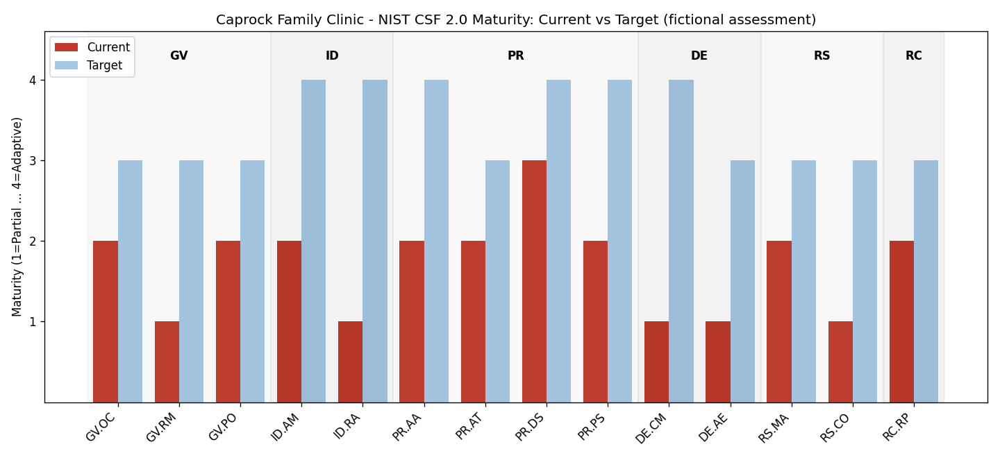

# NIST CSF 2.0 Self-Assessment — Caprock Family Clinic (Fictional)

**Scope:** 3-site outpatient clinic, ~85 workforce members, cloud-hosted EHR, on-prem AD.
**Assessment date:** July 2026 · **Assessor role:** Security/GRC analyst · **Method:** see [docs/methodology.md](../docs/methodology.md)

## Summary

Overall maturity averages **1.7 of 4** against a target profile of 3.4. The clinic runs
competent day-to-day IT but has never formalized security governance: the two
lowest-scoring areas — **risk assessment (ID.RA: 1)** and **continuous monitoring
(DE.CM: 1)** — are also the two with direct HIPAA citation exposure, which drives
their position at the top of the [POA&M](../poam/poam.md).

## Function-by-function findings

### GOVERN (avg 1.7)
Policies exist but are stale (3 years unreviewed) and unowned. There is **no risk
register and no documented risk appetite** — decisions like "do we patch the EHR
appliance during clinic hours" get made by whoever is on shift. GV.RM scored 1
because the absence of a risk management strategy is what allows every other gap
below to persist unranked.

### IDENTIFY (avg 1.5)
Workstation inventory is current, but **medical devices and SaaS are untracked**
(ID.AM: 2) — you cannot protect assets you haven't enumerated. ID.RA scored **1**:
no HIPAA Security Risk Analysis is on file. This is not just a maturity gap; §164.308(a)(1)(ii)(A)
*requires* one, and it is the most-cited deficiency in OCR enforcement actions.

### PROTECT (avg 2.3) — strongest function
Encryption on endpoints and RBAC in AD are in place. Gaps concentrate in lifecycle
discipline: **manual deprovisioning, no periodic access review, partial MFA** (PR.AA: 2)
and an **EHR vendor appliance unpatched for 14 months** (PR.PS: 2). Backup restores
are untested (PR.DS: 3 with a caveat — an untested backup is a hope, not a control).

### DETECT (avg 1.0) — weakest function
EHR audit logs are retained but **never reviewed, with no alerting on PHI access**
(DE.CM: 1). §164.308(a)(1)(ii)(D) requires information-system activity review;
today a snooping employee or an orphaned account would be found by accident or
by OCR, not by the clinic.

### RESPOND (avg 1.5)
An EHR downtime runbook exists (operational maturity) but there is **no security
incident-response plan and breach-notification duties are unassigned** (RS.CO: 1).
The HIPAA breach clock is 60 days from discovery — with no owner, discovery-to-
notification is an unmanaged legal risk.

### RECOVER (avg 2.0)
Nightly backups run; the last restore test was 18 months ago and RTO/RPO are
undefined. Ransomware readiness is therefore unproven.

## Scoring reference

| Score | Meaning |
|---|---|
| 1 — Partial | Ad hoc, undocumented, person-dependent |
| 2 — Risk-informed | Practices exist but inconsistent or unmeasured |
| 3 — Repeatable | Documented, owned, consistently performed |
| 4 — Adaptive | Measured, tested, and improved on a cycle |

Raw scores: [scores.csv](scores.csv) · HIPAA linkage: [hipaa-security-rule-crosswalk.md](hipaa-security-rule-crosswalk.md)
